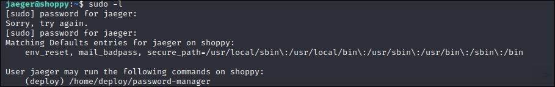

# Shoppy HTB

## Enumeration

### NMAP

3 services présents:
- SSH sur le port 22
- HTTP sur le port 80
- copycat sur le port 9093

Ajoutons le nom de domaine **shoppy.htb** à notre **/etc/hosts**.
Et allons voir manuellement avec un navigateur.

"Coming soon!", peut-être pourrons-nous trouver un hôte virtuel qui héberge une version en développement...

### GOBUSTER

Continuons avec l'énumération de l'arborescence du site à la recherche d'autres pages.

Nous avons une page de connexion **/login**.

Et un sous-domaine **mattermost.shoppy.htb** sur lequel nous reviendrons plus tard. Ajoutons-le au fichier **/etc/hosts**.

## EXPLOITATION

Après quelques essais pour contourner l'authentification avec des méthodes basiques d'injection, le système a définitivement un problème avec les apostrophes ' (%27)

### NoSQLi AUTHENTICATION BYPASS

Finalement, on y arrive avec une [injection NoSQL](https://book.hacktricks.xyz/pentesting-web/nosql-injection#sql-mongo).

On se retrouve sur une page administration.

Et, semble-t-il, une fonctionnalité pour rechercher des utilisateurs !?
La base de données est probablement la même... Essayons la même injection que pour nous connecter !
 

Ce qui nous permet d'exporter leurs données.

2 utilisateurs avec les hashs MD5 de leurs mots de passe:
- admin 
- josh

Et les hashs des leurs mots de passe.
Crackons-les avec JohnTheRipper.

Seul celui de **Josh** est dans *rockyou.txt*.
Revenons maintenant au sous-domaine **mattermost.shoppy.htb**.

Une autre page de connexion, mais cette fois, nous avons les identifiants de **Josh**.

On arrive sur ce qui semble être la messagerie interne de l'entreprise.
Et d'autres identifiants, un nom d'utilisateur et son mot de passe, sont fournis dans la section qui parle du déploiement.

## FOOTHOLD

En nous connectant en SSH en tant que **Jaeger**, nous obtenons un point d'entrée stable sur la machine cible.

Et nous pouvons récupérer le flag **user.txt**

Voyons les permissions *sudo* de l'utilisateur **jaeger** sur la machine.

Il a le droit d'exécution sur un fichier en tant que **deploy**. Apparemment un gestionnaire de mots de passe rudimentaire, qui demande un premier mot de passe maître pour lire un fichier dans lequel sont écrits d'autres identifiants.

Mais **jaeger** a également les droits de lecture dessus. Un simple **cat** suffit à le révéler.

 

Maintenant que nous avons le "master password", nous pouvons lire les identifiants de l'utilisateur **deploy**.

## LATERAL MOVEMENT

## PRIVILEGE ESCALATION

Ce nouvel utilisateur fait partie du groupe **docker**, qui permet de faire de la sorcellerie...

Comme monter le dossier */root* (ou bien l'ensemble du système) dans un container dont il a tout les droits.

[GTFOBins](https://gtfobins.github.io/gtfobins/docker/#shell)

Merci à [lockscan](https://app.hackthebox.com/users/217870) pour cette box très accessible pour les débutants.

N'hésitez pas à aller lui donner du "respect" sur son profil si elle vous a plu.

### Liens:
- [injection NoSQL sur une Base de données MongoDB](https://book.hacktricks.xyz/pentesting-web/nosql-injection#sql-mongo)
- [Escalade de privilèges grâce à Docker sur GTFOBins](https://gtfobins.github.io/gtfobins/docker/#shell)
- [Profil HackTheBox de lockscan](https://app.hackthebox.com/users/217870)

